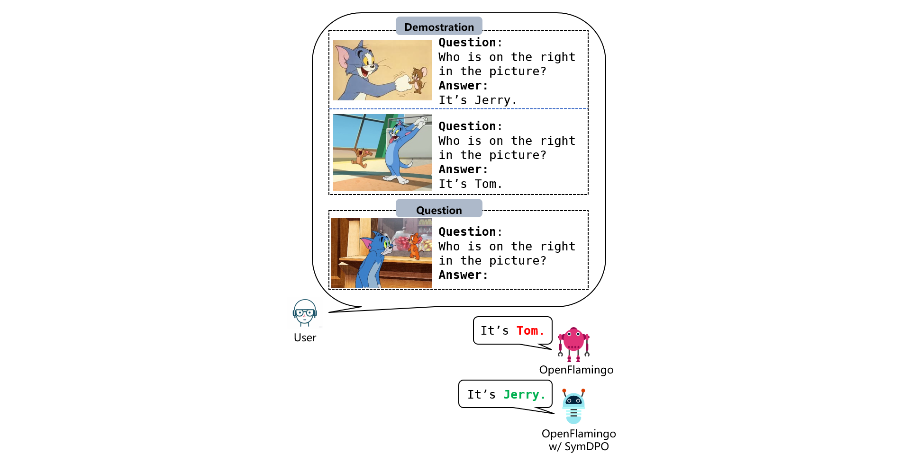

# SymDPO: Breaking the Bottleneck in Multimodal Example Understanding


---

## 📚 Introduction

As language models continue to scale, **Large Language Models (LLMs)** have exhibited remarkable capabilities in **In-Context Learning (ICL)**, enabling them to solve language tasks by prefixing a few in-context demonstrations (ICDs). Inspired by these advancements, researchers have extended these techniques to **Large Multimodal Models (LMMs)** with ICL capabilities.

However, existing LMMs face a critical issue: they often fail to effectively leverage the **visual context** in multimodal demonstrations and instead simply follow textual patterns. This highlights a lack of alignment between multimodal demonstrations and model outputs.

To address this issue, we propose **Symbol Demonstration Direct Preference Optimization (SymDPO)**. SymDPO breaks the traditional paradigm of constructing multimodal demonstrations by replacing text answers in examples with **random symbols**, forcing the model to carefully understand the demonstration images and establish relationships between images and symbols to answer questions correctly.

We validate the effectiveness of SymDPO on multiple benchmarks, demonstrating its ability to enhance the multimodal context understanding of LMMs and improve their ability to answer questions accurately.

---

<!-- ## 🛠️ Features

- **Improved Multimodal Context Alignment**: By substituting text answers with symbols, SymDPO ensures better alignment between visual context and model outputs.
- **Enhanced Reasoning Capabilities**: SymDPO helps LMMs move beyond textual patterns, leveraging visual context more effectively.
- **Proven Effectiveness**: Validated across multiple benchmarks with significant performance improvements.

--- -->

## 📦 Installation

1. Clone the repository:
   ```bash
   git clone https://github.com/APiaoG/SymDPO.git
   cd SymDPO
   ```

2. Install dependencies:
   ```bash
   conda env create -f environment.yml
   ```

---

## 🚀 Quick Start

Here’s how to use the model to inference:

1. Prepare your multimodal examples (including images and text answers).
2. Download the model weights. (The model weights trained with SymDPO will be released soon.)
3. Modify the file paths in `open_flamingo/scripts/inference.py` accordingly.  
4. Run the `inference.py` file to perform inference.
   ```bash
   conda activate SymDPO
   python open_flamingo/scripts/inference.py
   ```

---

### 🏋️ Training

#### 1️⃣ **SymDPO**

To use **SymDPO** to train the model built upon OpenFlamingo, follow these steps:

---

 Modify the file paths in the file `open_flamingo/scripts/train_dpo.sh`, then run the following command:
   ```bash
   sh open_flamingo/scripts/train_dpo.sh
   ```

---

#### 2️⃣ **SFT**

We also provide code for SFT. Please follow these steps:

---

 Modify the file paths in the file `open_flamingo/scripts/train_sft.sh`, then run the following command:

   ```bash
   sh open_flamingo/scripts/train_sft.sh
   ```

---


#### 3️⃣ **Evaluation**

1. Please download the files required for the following dataset:
   - COCO
   - Flickr-30K
   - VQAv2
   - OKVQA
   - TextVQA

2. Modify the file paths in the file `open_flamingo/scripts/run_eval.sh`, then run the following command:
   ```bash
   sh open_flamingo/scripts/run_eval.sh
   ```

---


## 🧪 Example Usage

Here is a comparison of results between OpenFlamingo-3B-Instruct trained with SymDPO and OpenFlamingo-3B-Instruct not trained with SymDPO:


---

## 📊 Benchmark Results

Performance comparison across multiple benchmarks:


Detailed results and methodology can be found in the [paper](./docs/paper.pdf).

---


## 📄 License

This project is licensed under the [MIT License](./LICENSE).

---

## 📧 Contact

If you have any questions or suggestions, feel free to reach out:

- GitHub Issues: [Create an issue](https://github.com/APiaoG/SymDPO/issues)
- Email: jiahongrui@stu.pku.edu.cn

---
